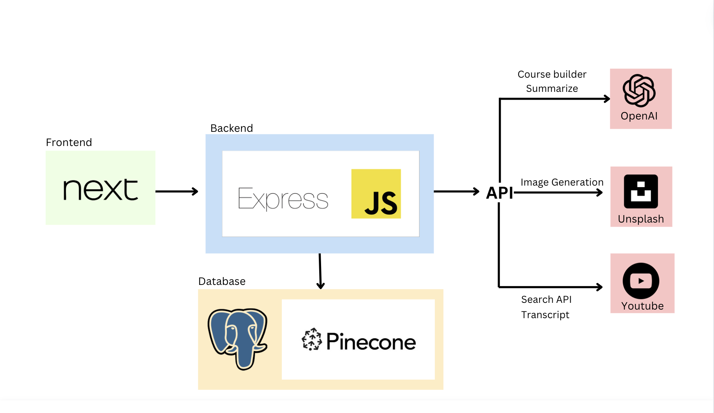

# Curata

## What it Does

A Generative AI (GenAI) Course Builder and Summariser that allows students to curate personalised educational material for self-study and revision purposes. We provide 2 main functionality (1) Course building and (2) Course summarising. In the course builder, students can define the course and sub-topics they want to build, Curata will aid students in generating chapters and source for top videos that students can browse to learn more about the topic. As for the course summarisation, students will upload a PDF which will be summarised by Curata and Curata will also generate concept checks quizes regarding this pdf.

## Application Overview

-   **Front-End:** Next.js, Tailwind CSS
-   **Back-End:** Express.js, Sequelize
-   **Data:** PostgreSQL, PineconeDB

You can access a demo video of the application [here](https://drive.google.com/file/d/1XzsNnfFu_IQkG4_eF3zAWpyNQ7AFglfD/view?usp=sharing).

